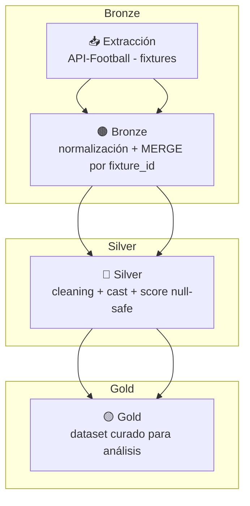

# ⚽ ETL Pipeline de Datos de Fútbol (API-Football)

🌐 Available in [English](README_EN.md)

Proyecto de **Ingeniería de Datos** que implementa un pipeline **ETL automatizado** para la ingesta, transformación y almacenamiento de datos de **API-Football**, organizado en capas **Bronze / Silver / Gold** y orquestado con **Prefect**.

---

## 🧰 Stack Tecnológico
- **Lenguaje:** Python 3.11  
- **Orquestación:** Prefect **2.x**  
- **Procesamiento:** **Pandas**  
- **Formato/Tablas:** **Delta Lake** (Parquet + `_delta_log`)  
- **Almacenamiento:** Data Lake local por capas (partición por `event_date`)  
- **Versionado:** Git / GitHub  
- **Visualización:** Matplotlib, Seaborn

---

## 🧩 Estructura del pipeline

1. **Ingesta — Bronze**  
   - Extracción desde el endpoint dinámico `fixtures` (headers con API key).  
   - Persistencia en **Delta Lake** con **MERGE** por `fixture_id` y **partición** por `event_date`.

2. **Transformación — Silver**  
   - Limpieza/normalización (renombrado, casteos, null-safe en columnas de score).  
   - Persistencia incremental en Delta (mismo merge/partición).

3. **Curación — Gold**  
   - Dataset curado para análisis (columnas relevantes).  
   - Exportables en **CSV** y **Parquet**.

---

## ⚙️ Árbol (simplificado)

```
data/etl_datalake/
├── bronze/api_football/fixtures/
├── silver/api_football/fixtures/
├── gold/api_football/fixtures/
└── exports/
scripts/
├── etl_fixtures.py
└── etl_utils.py
notebooks/
├── ETL_API_Football.ipynb               # versión manual
└── ETL_API_Football_Prefect.ipynb       # orquestación
```

---

## 🔄 Diagrama del pipeline (Mermaid)



---

## 📊 Resultados principales
- Ingesta incremental con **MERGE por `fixture_id`** y **partición por `event_date`**.  
- Orquestación en Prefect 2.x (reintentos, trazabilidad de runs).  
- Datasets listos para análisis (ej.: goles totales, ganador del partido, home/away).

---

## 🧠 Conclusión
Pipeline **end-to-end** reproducible y extensible. La modularidad permite migrar a cloud (GCS/Databricks) sin cambios de modelo de datos.

---

## 🪪 Licencia
Este proyecto se distribuye bajo la licencia MIT.  
Ver archivo [LICENSE](LICENSE).

---

## ✍️ Autor
**Elías Fernández**

---

## 📫 Contacto
📧 [fernandezelias86@gmail.com](mailto:fernandezelias86@gmail.com)  
🔗 LinkedIn: [Perfil](https://www.linkedin.com/in/eliasfernandez208)
