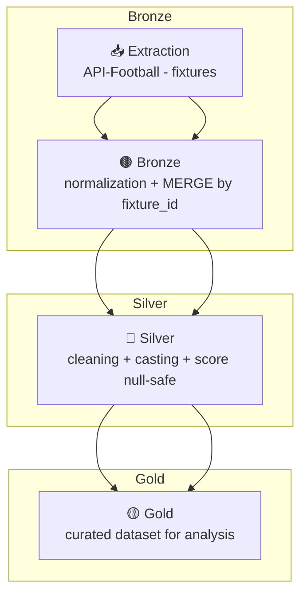

# ⚽ Football Data ETL Pipeline (API-Football)

🌐 Disponible en [Español](README.md)

Data Engineering project that implements an **automated ETL pipeline** for ingesting, transforming, and storing **API-Football** data, organized into **Bronze / Silver / Gold** layers and orchestrated with **Prefect**.

---

## 🧰 Tech Stack
- **Language:** Python 3.11  
- **Orchestration:** Prefect **2.x**  
- **Processing:** **Pandas**  
- **Format/Tables:** **Delta Lake** (Parquet + `_delta_log`)  
- **Storage:** Local Data Lake (partitioned by `event_date`)  
- **Version Control:** Git / GitHub  
- **Visualization:** Matplotlib, Seaborn

---

## 🧩 Pipeline Structure

1. **Ingestion — Bronze**  
   - Dynamic extraction from the `fixtures` endpoint (with API key headers).  
   - Persisted in **Delta Lake** using **MERGE** on `fixture_id` and **partitioned** by `event_date`.

2. **Transformation — Silver**  
   - Cleaning and normalization (column renaming, type casting, null-safe operations).  
   - Incremental persistence in Delta (same merge/partition logic).

3. **Curation — Gold**  
   - Curated dataset for analysis (selected relevant columns).  
   - Exported in **CSV** and **Parquet** formats.

---

## ⚙️ Directory Tree (simplified)

```
data/etl_datalake/
├── bronze/api_football/fixtures/
├── silver/api_football/fixtures/
├── gold/api_football/fixtures/
└── exports/
scripts/
├── etl_fixtures.py
└── etl_utils.py
notebooks/
├── ETL_API_Football.ipynb               # manual version
└── ETL_API_Football_Prefect.ipynb       # orchestrated version
```

---

## 🔄 Pipeline Diagram (Mermaid)



---

## 📊 Key Results
- Incremental ingestion with **MERGE on `fixture_id`** and **partition by `event_date`**.  
- Prefect 2.x orchestration (automatic retries and run tracking).  
- Ready-to-use datasets for analysis (e.g., total goals, match winner, home/away trends).

---

## 🧠 Conclusion
An **end-to-end** reproducible and extensible pipeline. Its modular design allows future migration to cloud platforms (GCS/Databricks) with no data model changes.

---

## 🪪 License
This project is distributed under the MIT License.  
See the [LICENSE](LICENSE) file.

---

## ✍️ Author
**Elías Fernández**

---

## 📫 Contact
📧 [fernandezelias86@gmail.com](mailto:fernandezelias86@gmail.com)  
🔗 LinkedIn: [Profile](https://www.linkedin.com/in/eliasfernandez208)
